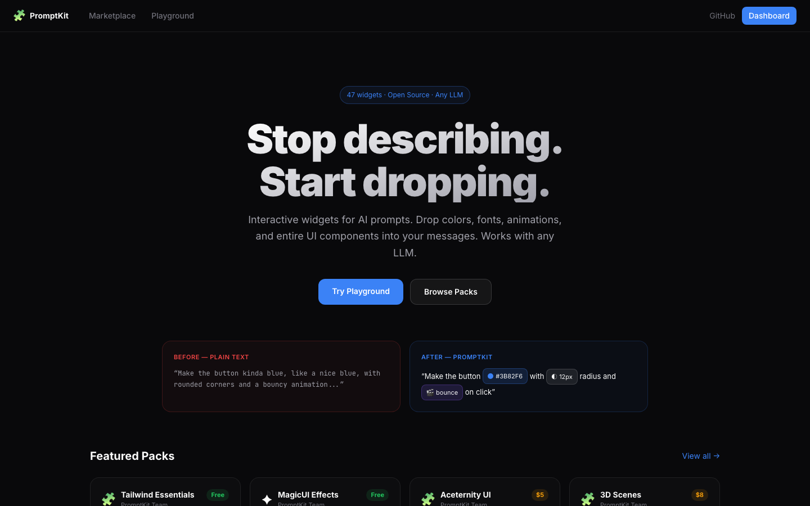
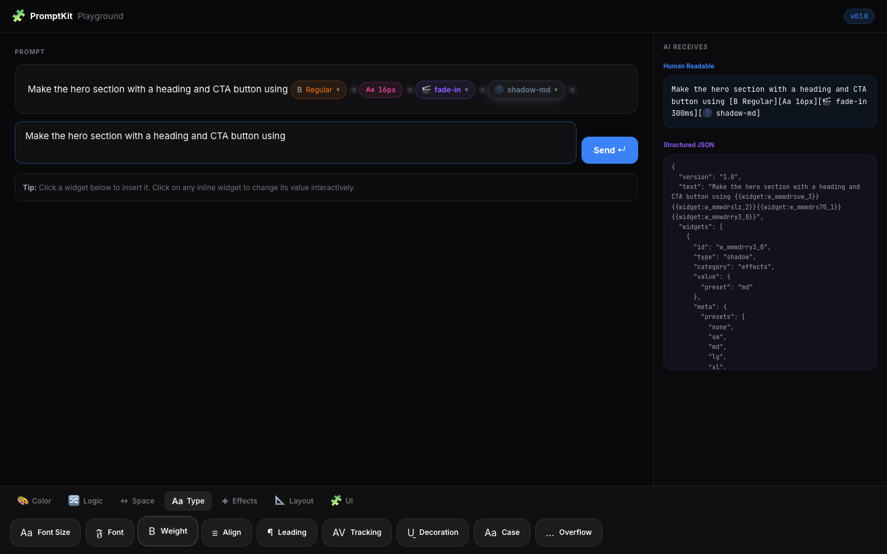
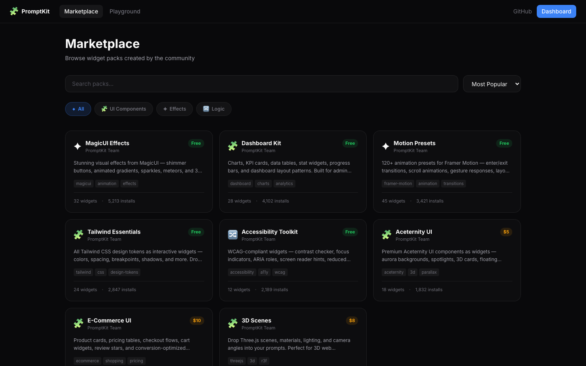
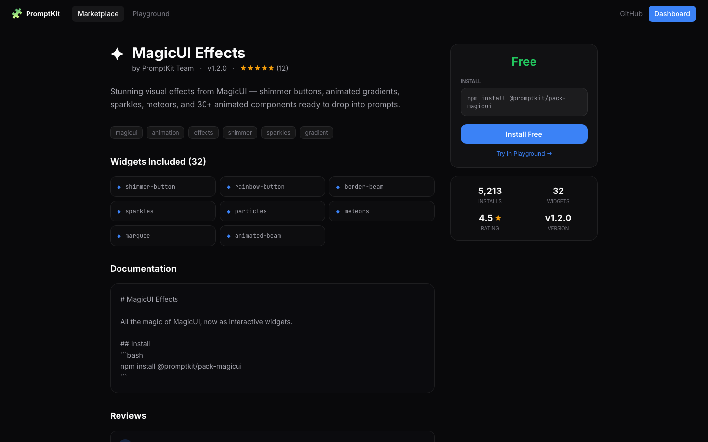
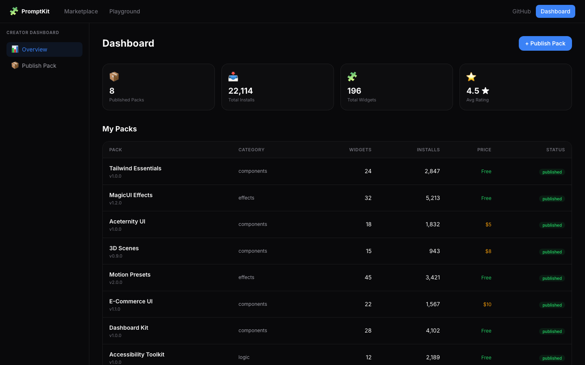
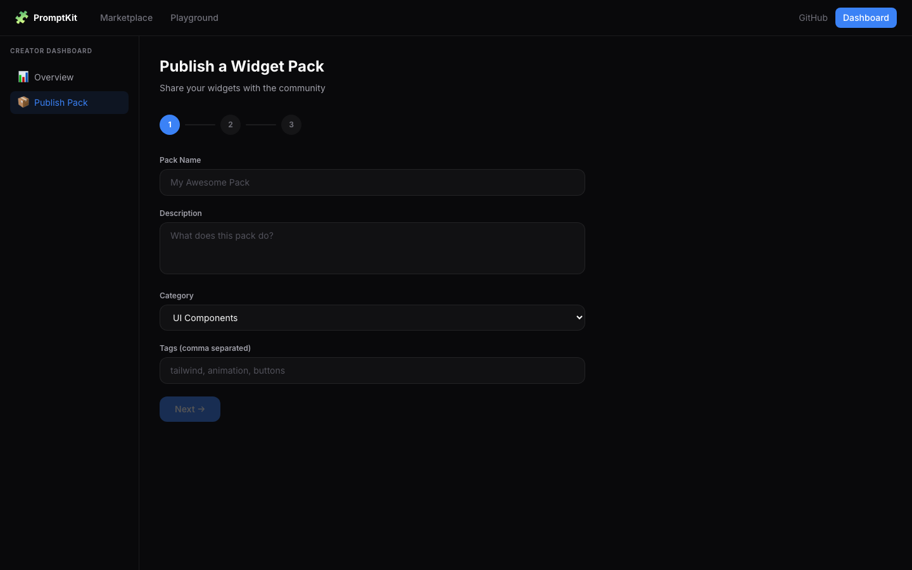

<p align="center">
  <h1 align="center">🧩 PromptKit</h1>
</p>

<div align="center">

**Interactive widgets for AI prompts. Stop describing, start dropping.**

[Playground](https://promptkit.dev/playground) · [Marketplace](https://promptkit.dev/marketplace) · [Getting Started](#-getting-started) · [Features](#-features) · [Architecture](#-architecture) · [Roadmap](#-roadmap) · [License](LICENSE)

[](LICENSE)
[](https://nextjs.org)
[](https://typescriptlang.org)
[](https://react.dev)
[](https://tailwindcss.com)
[]()

</div>

<br />

<p align="center">
  
</p>

<br />

## Why PromptKit?

Today's vibe coding is **text-only prompting** — users describe what they want in words, hoping the AI interprets correctly. Colors become "kinda blue", spacing becomes "not too much", and animations become "something bouncy". Every prompt is a gamble.

PromptKit replaces guesswork with **precision**. Users drop interactive widgets — color pickers, sliders, animation presets, component selectors — directly into their prompts. The AI receives **exact values** instead of vague descriptions.

```
❌  "Make the button kinda blue, with rounded corners, not too rounded
     but like medium, and add a bouncy animation when you click it"

✅  "Make the button [color: #3B82F6] with [border-radius: 12px]
     and [animation: bounce 500ms] on click"
```

> [!NOTE]
> **Inspired by [Spielwerk's Cheats](https://x.com/spielwerkapp)** — interactive artifacts in prompts for game creation. PromptKit brings this concept to **all of vibe coding** as an open-source, pluggable library.

<br />

## ✦ Features

### Drop-in Integration (3 Lines)

Replace any chat `<textarea>` with PromptKit. Works with **any LLM** — GPT, Claude, Gemini, Llama, Mistral.

```tsx
import { PromptKitInput } from "@promptkit/react"
import { essentialsPack } from "@promptkit/widget-pack-essentials"

<PromptKitInput
  packs={[essentialsPack]}
  onSubmit={(result) => {
    // result.forAI       → formatted prompt for any LLM
    // result.systemPrompt → teaches the LLM the widget format
    sendToLLM([
      { role: "system", content: result.systemPrompt },
      { role: "user", content: result.forAI },
    ])
  }}
/>
```

<br />

### Interactive Playground

<p align="center">
  
</p>

<br />

### 47 WYSIWYG Widgets

Every widget **visually reacts** to its value in real time — fonts change, colors glow, animations play, borders render, patterns appear.

| | Category | Widgets | Examples |
|:--|:--|:--|:--|
| 🎨 | **Color** | 4 | Color picker, opacity, gradient (dual picker + 8 directions), CSS filters |
| Aa | **Typography** | 9 | Font size (scales live), font family (renders in the font), weight, align, leading, tracking, decoration, transform, overflow |
| ↔ | **Spacing** | 3 | Gap/padding (animated bars), border-radius (corners morph), border (style renders on chip) |
| 📐 | **Layout** | 10 | Grid columns (animated grid), flex direction (rotating arrow), justify, align, position, display, overflow, aspect-ratio, object-fit, breakpoint |
| ✦ | **Effects** | 7 | Shadow (real box-shadow on chip), blur (text blurs), animation (icon plays the animation), effects (glow/shimmer), transform (chip rotates/scales), decorations, scroll FX |
| 🧩 | **UI Components** | 12 | Text effects, button styles, backgrounds, card styles, navigation, device frames, social proof, 3D — all from **MagicUI** + **Aceternity** via 21st.dev |
| 🔀 | **Logic** | 4 | Toggle (glow ON, strikethrough OFF), select, slider, cursor (real cursor on chip) |

<br />

### What the AI Actually Receives

When a user sends a prompt with widgets, the AI gets **structured data with exact CSS values and install commands**:

```
Create a hero with [color: #3B82F6] heading, [font-family: Inter],
[font-size: 48px]. Add a [button-style: shimmer-button (magicui)] CTA.
Use [background: aurora-background (aceternity)] behind it.

---
Widget Specifications:
- color: CSS color: #3B82F6
- font-family: CSS font-family: 'Inter', sans-serif
- font-size: CSS font-size: 48px
- button-style: use magicui/shimmer-button
  (npx shadcn@latest add "https://21st.dev/r/magicui/shimmer-button")
- background: use aceternity/aurora-background
  (npx shadcn@latest add "https://21st.dev/r/aceternity/aurora-background")
```

Plus a system prompt (`PROMPTKIT_SYSTEM_PROMPT`) that teaches any LLM to interpret the notation.

<br />

### Marketplace

Browse, search, and install community widget packs.

<p align="center">
  
</p>

<p align="center">
  
</p> Creators publish packs, users install them.

| | Feature | Description |
|:--|:--|:--|
| 🏪 | **Browse** | Search + filter by category + sort (popular/new/name) |
| 📦 | **Pack Detail** | Widgets list, reviews, install command, stats, pricing |
| 📊 | **Creator Dashboard** | My packs, total installs, ratings, revenue |
| 📝 | **Publish** | 3-step form: info → package → review → live |
| 🔌 | **REST API** | `/api/packs`, `/api/categories` — JSON endpoints |

<br />

### Creator Dashboard

<p align="center">
  
</p>

<p align="center">
  
</p>

<br />

### CLI

```bash
npx promptkit create-pack my-pack   # Scaffold a new widget pack
npx promptkit validate              # Validate before publishing
npx promptkit publish               # Publish to the marketplace
```

<br />

### Terminal UI

Interactive widget editing directly in the terminal — keyboard-driven, no GUI needed:

```
🧩 PromptKit │ Typing │ 3 widgets
╭──────────────────────────────────────────────────────╮
│ Make the button ● #3B82F6 with ◐ 12px radius        │
│ and 🎬 bounce animation                              │
╰──────────────────────────────────────────────────────╯

←→↑↓: edit value │ Tab: next widget │ Enter: send │ Ctrl+C: quit
```

<br />

## 🆚 Comparison

| Capability | PromptKit | Plain Text Prompts | Figma-to-Code | Design Tokens |
|:--|:--:|:--:|:--:|:--:|
| Inline in prompts | ✅ | ❌ | ❌ | ❌ |
| Interactive/editable | ✅ | ❌ | ❌ | ⚠️ |
| WYSIWYG preview | ✅ | ❌ | ✅ | ❌ |
| Works with any LLM | ✅ | ✅ | ❌ | ❌ |
| Component-level (MagicUI, etc.) | ✅ | ❌ | ❌ | ❌ |
| Marketplace / extensible | ✅ | ❌ | ❌ | ⚠️ |
| Terminal support | ✅ | ✅ | ❌ | ❌ |
| Open source | ✅ | N/A | ⚠️ | ✅ |

<br />

## 🚀 Getting Started

### Prerequisites

- **Node.js** 20+
- No database required for development (seed data built-in)

### Quick Setup

```bash
# Clone & install
git clone https://github.com/PromptKit-ai/promptkit.git
cd promptkit
npm install

# Build all 7 packages
npm run build

# Start the app (marketplace + playground)
npm run dev
```

Open **[http://localhost:3099](http://localhost:3099)** — you're in.

> [!TIP]
> No environment variables needed for development. The marketplace uses built-in seed data. Configure `DATABASE_URL` and auth providers when deploying to production.

<details>
<summary><strong>Environment Variables (production)</strong></summary>

<br />

| Variable | Required | Description |
|:--|:--:|:--|
| `DATABASE_URL` | ✅ | Neon/PostgreSQL connection string |
| `NEXTAUTH_SECRET` | ✅ | NextAuth secret (`openssl rand -base64 32`) |
| `GITHUB_CLIENT_ID` | | GitHub OAuth client ID |
| `GITHUB_CLIENT_SECRET` | | GitHub OAuth secret |
| `GOOGLE_CLIENT_ID` | | Google OAuth client ID |
| `GOOGLE_CLIENT_SECRET` | | Google OAuth secret |

</details>

<br />

## 🏗 Architecture

### Tech Stack

| Layer | Technology |
|:--|:--|
| **Monorepo** | Turborepo |
| **Language** | TypeScript 5 (strict) |
| **Build** | tsup (tree-shakeable ESM) |
| **Framework** | Next.js 15 (App Router, Turbopack) |
| **UI** | React 19, Tailwind CSS v4, Framer Motion |
| **Terminal** | Ink (React for CLI) |
| **Database** | Drizzle ORM + Neon PostgreSQL |
| **Auth** | NextAuth v5 |
| **Tests** | Vitest (30 tests) |

### Packages

```
promptkit/
├── packages/
│   ├── protocol/              # TypeScript types (WidgetPack, Widget, etc.)
│   ├── core/                  # Parser, serializer, registry, AI formatter
│   ├── react/                 # React components + PromptKitInput drop-in
│   ├── tui/                   # Terminal UI (ink-based)
│   ├── cli/                   # CLI: create-pack, validate, publish
│   └── widget-packs/
│       └── essentials/        # 47 built-in widgets
└── apps/
    └── demo/                  # Marketplace + Playground (Next.js 15)
```

### Widget Protocol

The token format: `{{type:key=value,key2=value2}}`

```
{{color:value=#3B82F6}}
{{radius:value=12,unit=px}}
{{animation:value=bounce,duration=500ms}}
{{button-style:value=shimmer-button,source=magicui}}
```

Parsed into `RichPrompt` → serialized for AI with `formatForAI()` → any LLM understands.

### Database — 6 Tables

```
Auth                    Marketplace              Tracking
────────────            ──────────────           ────────────
users                   packs                    downloads
accounts                pack_versions            api_keys
sessions                reviews
verification_tokens
```

<br />

## 🗺 Roadmap

- [ ] Deploy marketplace to Vercel
- [ ] Stripe Connect for creator payouts (20-30% commission)
- [ ] npm publish all packages to registry
- [ ] MCP Server for Cursor / Claude Code native integration
- [ ] Stripe Agent Toolkit for AI-driven pack purchases
- [ ] Project indexer (Pro) — drag & drop your own components into prompts
- [ ] Figma sync (Enterprise) — design system → widgets
- [ ] VS Code / Cursor extension
- [ ] Visual widget pack builder (no-code)
- [ ] Real-time collaborative editing

<br />

## 🏢 Who Uses PromptKit?

<table>
<tr>
<td align="center" width="120">
<br />
<strong>🧩</strong>
<br /><br />
</td>
<td>
<strong>Your project here</strong>
<br />
PromptKit is brand new. <a href="https://github.com/PromptKit-ai/promptkit/pulls">Open a PR</a> to add your integration.
</td>
</tr>
</table>

<br />

## 🤝 Contributing

Contributions welcome! Fork the repo, create a branch, and submit a PR.

```bash
npm install       # Install dependencies
npm run build     # Build all 7 packages
npm run dev       # Dev server on localhost:3099
npm run test      # Run 30 tests
```

### Create a Widget Pack

```bash
npx promptkit create-pack my-pack
cd my-pack
npm install
# Edit src/widgets/sample.ts
npm run build
npx promptkit validate
npx promptkit publish
```

<br />

## 📄 License

[MIT](LICENSE) — use it for anything.

<br />

---

<div align="center">

**PromptKit** — Stop describing. Start dropping.

Built with the conviction that AI prompts should be interactive, not just text.

<br />

[⬆ Back to top](#-promptkit)

</div>
